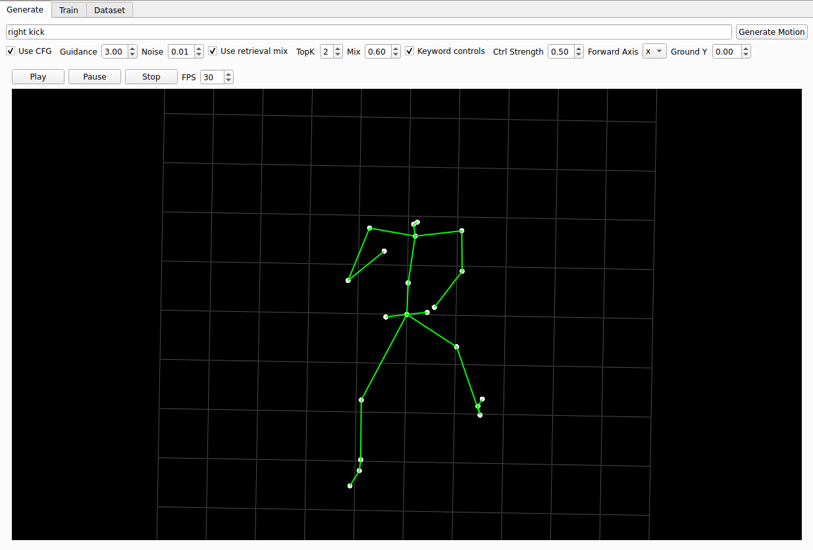

# Text-to-Motion (PyQt5 App)

Skeleton-based text→motion with:
- Transformer
- Prompt-aware retrieval mix (TF-IDF over captions)
- Deterministic keyword controllers (walk/run/jump/wave/turn/kick/sit/stand)
- PyQt5 GUI with real-time 3D viewer

> For research/education. Dataset: HumanML3D / KIT-ML.



---

## Features

- **GUI** (PyQt5): text inbox, generation controls, training controls, dataset tools, OpenGL 3D viewer  
- **Model**: encoder–decoder Transformer; CFG-style guided generation  
- **Retrieval mix**: prompt→Top-K caption match; blends retrieved motions with model  
- **Keyword controllers**: deterministic edits so actions are visibly different per prompt  
- **Viewer**: KIT-21 joints; orbit/zoom; FPS control; ground centering & scaling

---

## Quick Start

```bash
# Python 3.9–3.11 recommended
python -m venv .venv
source .venv/bin/activate

pip install -U pip
pip install pyqt5 pyqtgraph numpy torch torchvision torchaudio tqdm
# (If CUDA is available, install the matching torch build from pytorch.org)

python main.py
```

---

## Data

Dataset link - https://drive.google.com/drive/folders/1D3bf2G2o4Hv-Ale26YW18r1Wrh7oIAwK

Expected layout (example):

```
dataset/
  new_joints/          # motion .npy clips (T, 21, 3) or (T, 63) -> auto-reshaped
    00001.npy
    00002.npy
    ...
  texts/               # paired captions
    00001.txt
    00002.txt
    ...
  Mean.npy             # optional (not required by app)
  Std.npy              # optional (not required by app)
  train.txt            # optional (not required by app)
  val.txt              # optional (not required by app)
```

Build indices (one-to-one text↔motion) — outputs `train_index.json`, `val_index.json`:

```bash
python build_index_separate_texts.py \
  --root    /home/s5726453/Karan/Finals/dataset/new_joints \
  --texts-dir /home/s5726453/Karan/Finals/dataset/texts \
  --outdir /home/s5726453/Karan/Finals/indices
```

In the **Dataset** tab:
1) Select `train_index.json` and (optionally) `val_index.json`  
2) Click **Build Vocab**

---

## Run

```bash
python main.py
```

### Generate tab
- Enter prompt → **Generate Motion**
- Controls:
  - **Use CFG** (on) — Guidance & Noise
  - **Use retrieval mix** — TopK & Mix (0..1)
  - **Keyword controls** — Strength (0..1)
  - **Forward Axis** (x/z), **Ground Y**

### Train tab
- **Start Training** — trains Transformer from scratch on the index  
- **Load Checkpoint** — loads `./checkpoints/text2motion_best.pt` if present

---

## Prompts

Short, action-focused prompts work well:

| Action keywords | Examples |
|---|---|
| walk | `walk forward`, `slow walk`, `step back` |
| run | `run forward`, `jog fast` |
| jump | `jump`, `hop in place` |
| wave | `wave right hand`, `wave left hand` |
| turn | `turn left`, `turn right` |
| kick | `right kick`, `left kick` |
| sit / stand | `sit down`, `stand idle` |

**Tip:** Mix = 0.4–0.7 for walk/run; Mix = 0 for wave (upper-body only) feels cleaner.  
**Ctrl Strength:** 0.5–0.9 (higher = stronger procedural action).

---

## How it works (short)

- **Transformer** encodes text and autoregressively decodes joints `(T, 21, 3)`  
- **CFG** scales text conditioning against a null prompt branch  
- **Retrieval**: TF-IDF over captions → Top-K motion clips → mean blend with model  
- **Keyword controllers**: deterministic pose edits (per action) blended on top  
- **Viewer**: pyqtgraph OpenGL; recenters to pelvis; auto-scales by mean bone length

---

## Project Structure

```
  main.py                 # PyQt5 app (tabs, hookups)
  viewer.py               # OpenGL skeleton viewer (KIT-21)
  model.py                # Transformer (encoder/decoder + generation)
  trainer.py              # training loop, dataloaders
  dataset_flex.py         # tokenizer, dataset, collate
  retrieval.py            # TF-IDF text DB + query_topk + keyword extract
  controllers.py          # prompt keyword controllers (walk/run/jump/wave/...)
  build_index_separate_texts.py  # index builder (motion ↔ text)
  indices/                # train_index.json, val_index.json
  dataset/                # motions (.npy), texts (.txt)
  checkpoints/            # saved ckpt (optional)
```

---

## CLI (optional)

Train (headless):
```bash
python -c "from trainer import Trainer,TrainConfig; \
from dataset_flex import WordTokenizer,HumanML3DDataset; \
import json; import torch; \
idx='indices/train_index.json'; \
tok=WordTokenizer(min_freq=1); \
txt=[r['text'] for r in json.load(open(idx))]; tok.fit(txt); \
ds=HumanML3DDataset(idx,tok,joints=21); \
cfg=TrainConfig(); cfg.joints=21; \
from model import Text2MotionTransformer; \
m=Text2MotionTransformer(tok.vocab_size,joints=21); \
t=Trainer(m,tok,ds,None,cfg,'./checkpoints/text2motion_best.pt',print); \
t.train()"
```

---

## Troubleshooting

**No module named `pyqtgraph`**
```bash
pip install pyqtgraph
```

**Permission denied writing indices**  
Write to a home folder (not `/dataset`):
```bash
python build_index_separate_texts.py --outdir ~/indices
```

**“No valid motion files found”**  
Check filenames in `texts/` match `new_joints/` (e.g., `00001.txt` ↔ `00001.npy`).

**Shape errors**  
Each `.npy`: `(T, 21, 3)` or `(T, 63)`; app auto-reshapes 63→(21,3).

**NaN loss during train**  
Lower LR, enable grad clip (default on), verify `.npy` doesn’t contain NaNs.

**Viewer shows static or huge skeleton**  
Indices must point to valid `.npy`. Viewer recenters/rescales; app normalizes per-clip.

---

## Config (defaults)

| Param | Default |
|---|---|
| d_model | 256 |
| nhead | 8 |
| enc_layers / dec_layers | 4 / 4 |
| ffn | 1024 |
| dropout | 0.1 |
| batch_size | 16 |
| epochs | 30 |
| lr | 1e-4 |
| grad_clip | 0.5 |
| max_text_len | 64 |
| max_motion_len | 196 |
| joints | 21 |

---

## Notes

  
- For wave prompts, retrieval mix is reduced to let the upper-body controller dominate.  
- Deterministic seed from prompt → stable generation per text.

---

## Dataset & Acknowledgements

- **HumanML3D / KIT-ML** datasets (copyright by respective authors).  
- Original HumanML3D repo: https://github.com/EricGuo5513/HumanML3D  
- This app uses a 21-joint skeleton and caption-level retrieval.

---

## License

Research/education only. Adjust license as needed for your repo.

